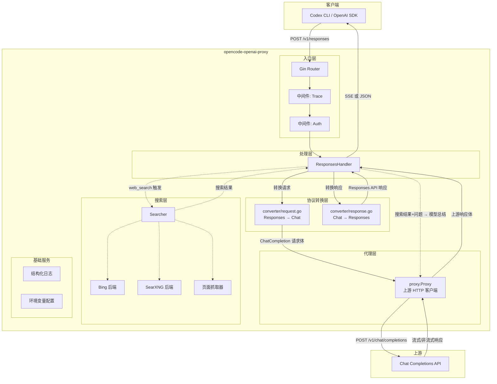
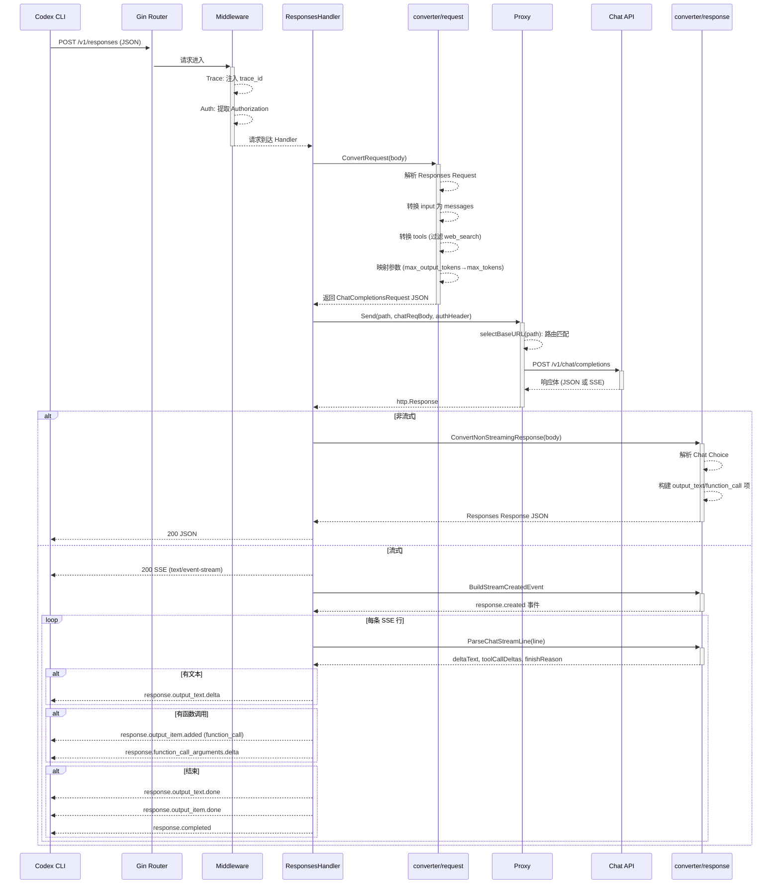
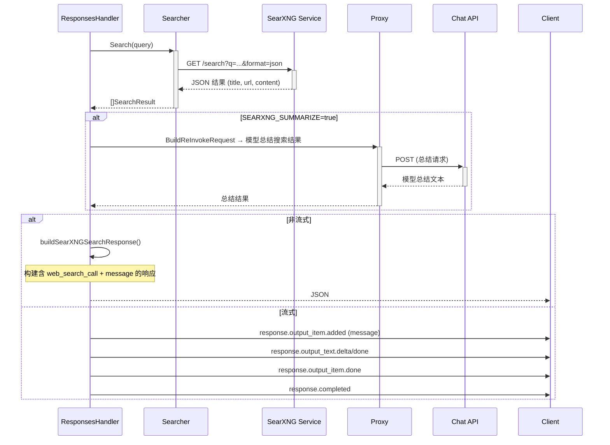
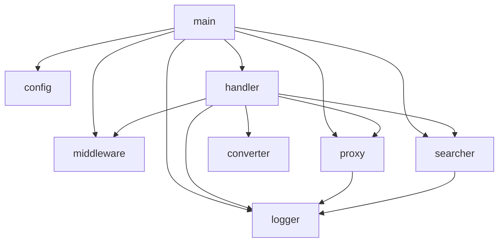
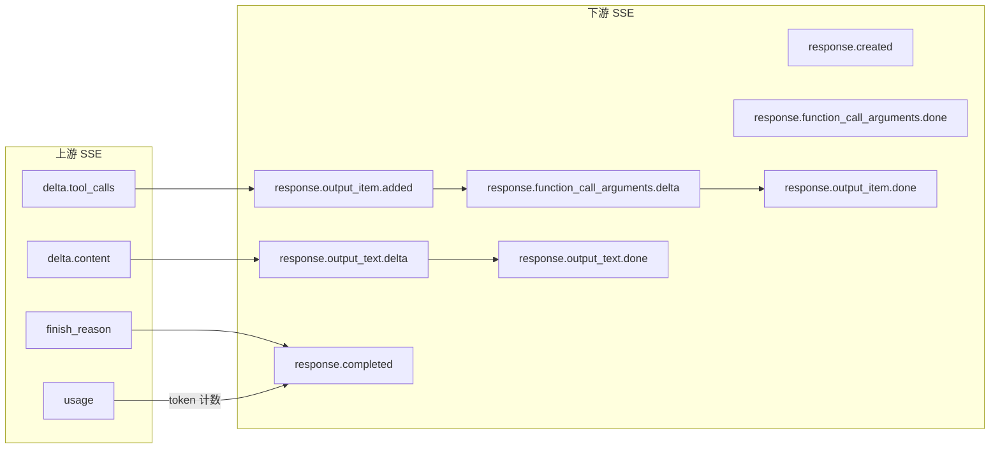

# opencode-openai-proxy 架构与流程

## 一、整体架构图



## 二、请求处理流程

### 2.1 核心调用链



### 2.2 搜索流程（非流式 / Bing 后端）

```mermaid
sequenceDiagram
    participant H as ResponsesHandler
    participant S as Searcher
    participant Fetcher as 页面抓取
    participant P as Proxy
    participant Upstream as Chat API

    H->>H: extractWebSearchToolCall(rawBody)
    Note over H: 检查上游响应中是否有 web_search tool_call

    alt 检测到 web_search
        H->>+S: Search(query)
        S->>S: searchBing(query) ← 解析 Bing SERP HTML
        S->>+Fetcher: fetchPages(results)
        Fetcher-->>-S: 页面正文 (前5000字符)
        S-->>-H: []SearchResult

        loop 最多 retryCount+1 次
            H->>+P: BuildReInvokeRequest(原始请求, 搜索结果)
            P->>+Upstream: 带搜索结果的二次请求
            Upstream-->>-P: 模型回答
            P-->>-H: 响应体
            H->>H: extractContentFromResponse()
            Note over H: 检查是否为 SEARCH_RESULT_INSUFFICIENT
            alt 结果有效
                break
            end
        end

        H->>H: buildSearchResponse(原始响应, 最终文本)
        H-->>Client: Responses API JSON
    else 无 web_search
        H->>H: ConvertNonStreamingResponse(rawBody)
        H-->>Client: 直接转换后的响应
    end
```

### 2.3 搜索流程（流式 / Bing 后端）

```mermaid
sequenceDiagram
    participant Client as Codex CLI
    participant H as ResponsesHandler
    participant S as Searcher
    participant P as Proxy
    participant Upstream as Chat API

    Note over H: 流式解析进行中...

    H->>Client: response.created
    H->>Client: response.output_item.added (web_search_call)

    loop 流式行
        H->>H: ParseChatStreamLine(line)
        alt 工具调用出现
            H->>Client: response.output_item.added (builtin tool)
            alt 文本增量
                H->>Client: response.output_text.delta
            end
        end
    end

    Note over H: 所有工具调用完成，检查是否全是 web_search

    alt 全部是 web_search
        H->>+S: Search(query)
        S-->>-H: 搜索结果

        loop 最多 retryCount+1 次
            H->>+P: 二次请求 (搜索结果+原始问题)
            P->>+Upstream: POST chat/completions
            Upstream-->>-P: 流式回答
            P-->>-H: 响应体
            H->>H: 解析流式行 → 累积文本
            alt 回答有效
                break
            end
        end

        H->>Client: response.output_item.added (新 message)
        H->>Client: response.output_text.delta / done
        H->>Client: response.output_item.done
    end

    H->>Client: response.completed
```

### 2.4 SearXNG 搜索流程



## 三、包依赖关系



## 四、数据结构转换映射

### 4.1 Responses API → Chat Completions

```mermaid
flowchart LR
    subgraph Responses API
        R_model[model]
        R_input[input]
        R_instructions[instructions]
        R_maxOutputTokens[max_output_tokens]
        R_tools[tools:<br/>web_search / function / computer]
        R_text[text.format]
    end

    subgraph Chat Completions
        C_model[model]
        C_messages[messages:<br/>system+user+assistant]
        C_maxTokens[max_tokens]
        C_tools[tools:<br/>全部转为 function 类型]
        C_responseFormat[response_format]
    end

    R_model --> C_model
    R_input -->|convertInput()| C_messages
    R_instructions -->|system 消息| C_messages
    R_maxOutputTokens --> C_maxTokens
    R_tools -->|convertTools()<br/>web_search→自定义function| C_tools
    R_text.format --> C_responseFormat
```

### 4.2 非流式响应：Chat Completions → Responses API

```mermaid
flowchart LR
    subgraph Chat 响应
        CC_choices[choices[0]]
        CC_message[message]
        CC_toolCalls[tool_calls]
        CC_usage[usage]
    end

    subgraph Responses 响应
        R_output[output]
        R_status[status]
        R_usage[usage]
    end

    CC_message.content -->|output_text| R_output
    CC_toolCalls -->|function_call / web_search_call| R_output
    CC_choices.finish_reason -->|MapFinishReason()| R_status
    CC_usage -->|convertUsage()| R_usage
```

### 4.3 流式 SSE 事件映射



## 五、关键设计决策

| 决策 | 说明 |
|---|---|
| **Tools 转换** | 所有 tool types（`web_search`、`function`、`computer` 等）统一转为 Chat Completions 的 `function` 类型。内置工具（`web_search`）使用预定义 schema |
| **web_search 的两种处理模式** | `BLOCK_WEB_SEARCH=true` 时过滤掉 web_search 工具，由客户端自行处理搜索；`false` 时由代理执行搜索并将结果注入二次请求给模型总结 |
| **路由分发** | 支持通过 `UPSTREAM_ROUTES` 按路径前缀匹配不同上游，最长前缀匹配，未匹配时回退到 `UPSTREAM_BASE_URL` |
| **搜索后端切换** | 通过 `SEARCH_BACKEND` 在 Bing（解析 SERP HTML）和 SearXNG（JSON API）之间切换 |
| **输出索引管理** | `StreamState.NextOutputIndex()` 确保每个 output item 有唯一递增的 `output_index`，消息和工具调用共享同一序列 |
| **SearXNG 搜索响应拦截** | 当检测到上游响应仅包含 web_search tool_call 时（非流式），拦截并替换为含 web_search_call + message 的完整响应 |
