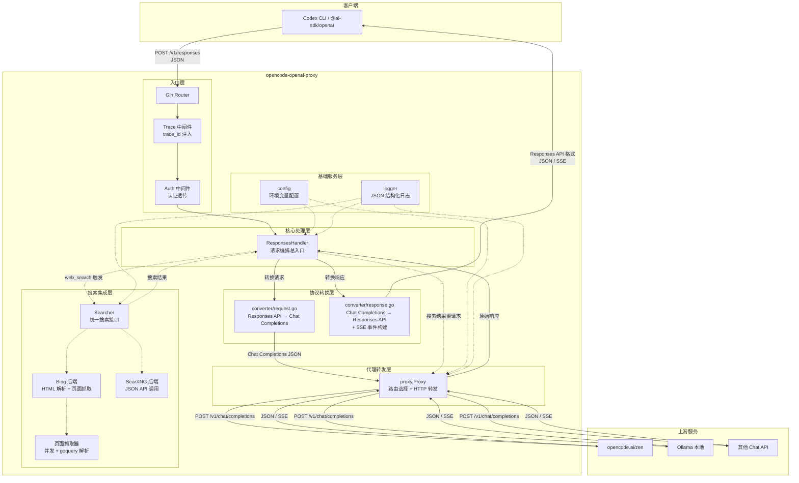
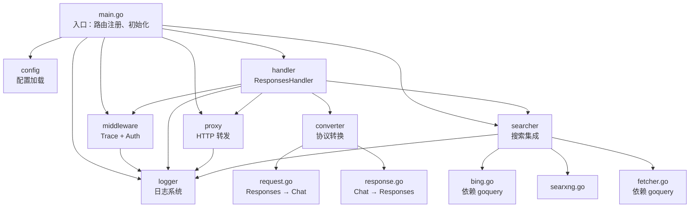
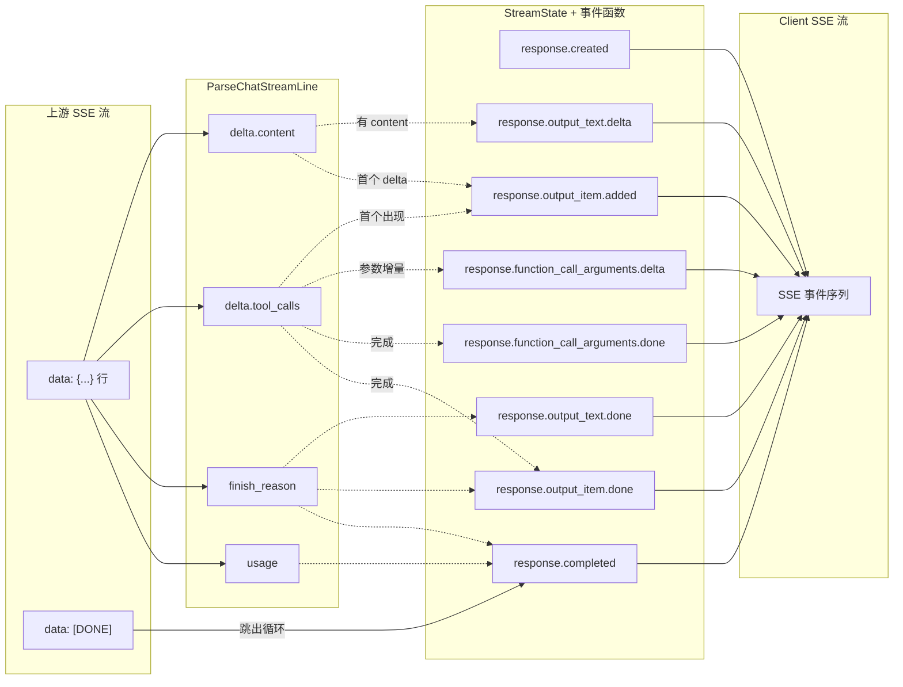
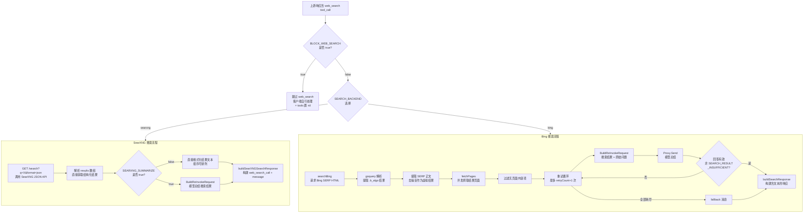
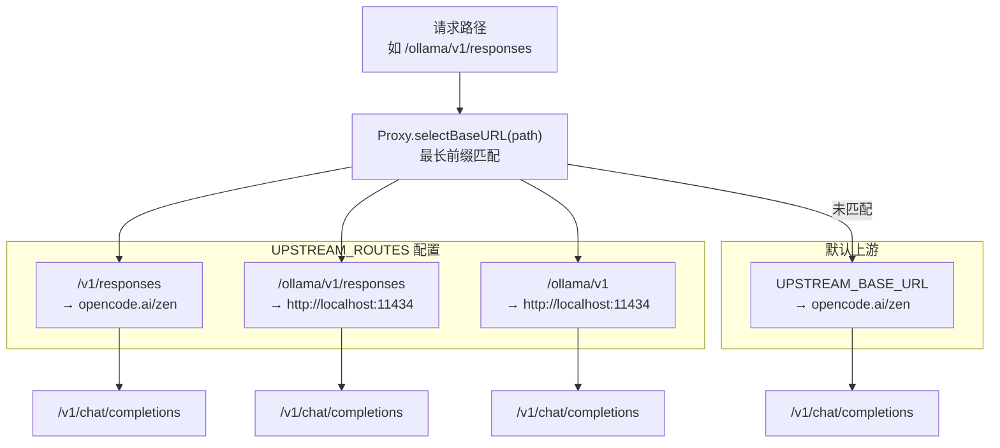
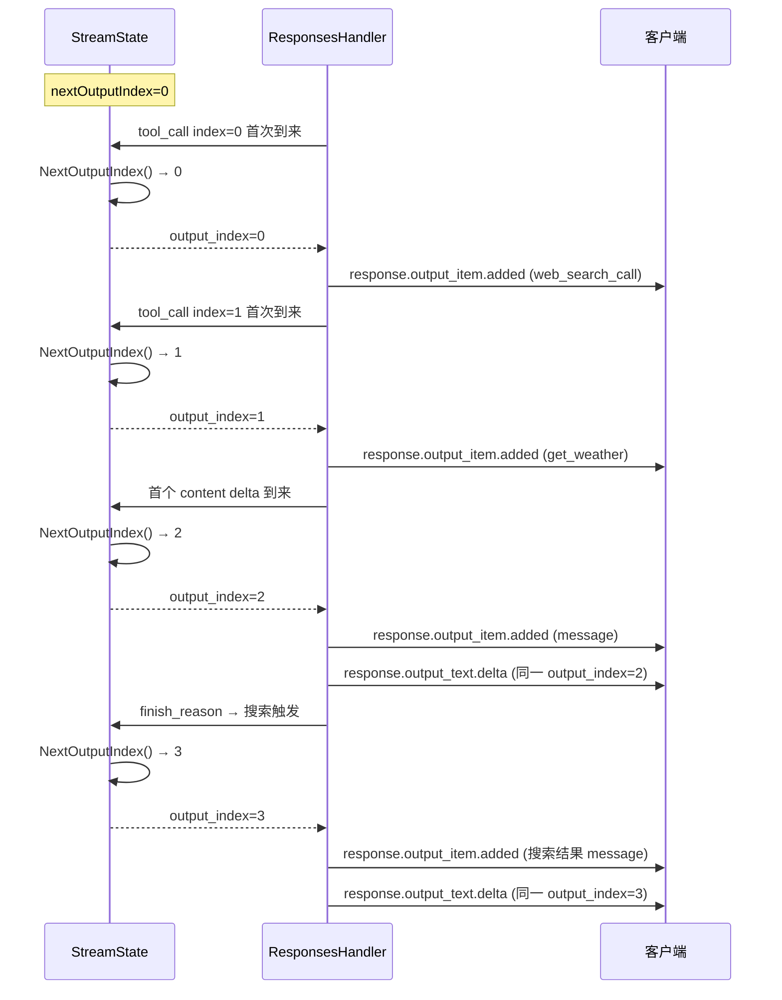
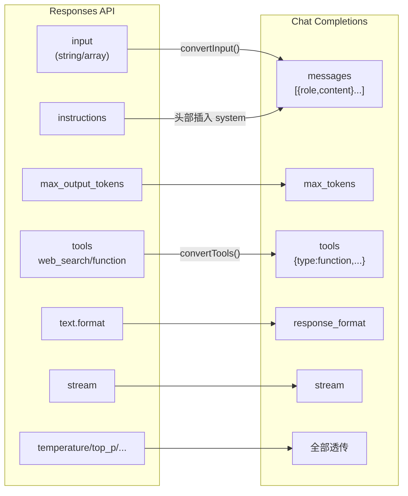
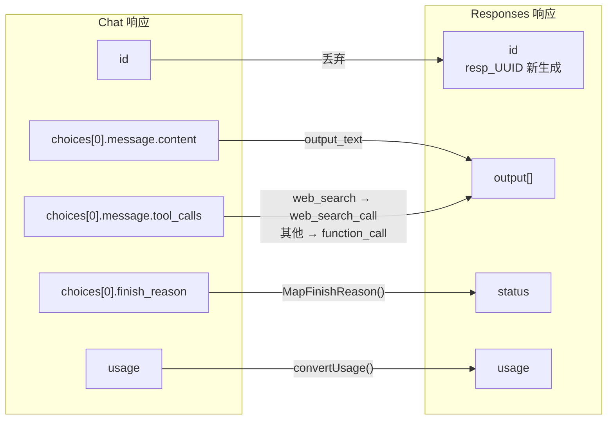

# opencode-openai-proxy 架构图

## 一、整体系统架构图



---

## 二、模块依赖关系图



---

## 三、请求响应数据流图

### 3.1 非流式请求数据流

```mermaid
flowchart LR
    subgraph 入站
        RAW[原始请求体<br/>JSON bytes]
    end

    subgraph 转换
        REQ[ResponsesRequest<br/>结构体解析]
        MSG[[]Message<br/>消息数组]
        CHAT[ChatCompletionsRequest<br/>JSON bytes]
    end

    subgraph 转发
        HTTP[HTTP POST<br/>上游响应]
    end

    subgraph 响应处理
        CHECK{"检测<br/>web_search<br/>tool_call?"}
        SEARCH_PROC[搜索处理<br/>SearXNG / Bing]
        CONV_RESP[ConvertNonStreamingResponse<br/>Chat → Responses]
        FINAL[最终响应体<br/>Responses API JSON]
    end

    RAW -->|json.Unmarshal| REQ
    REQ -->|convertInput| MSG
    REQ -->|convertTools| MSG
    MSG -->|json.Marshal| CHAT
    CHAT -->|Proxy.Send| HTTP
    HTTP -->|io.ReadAll| CHECK
    CHECK -->|无工具调用| CONV_RESP
    CHECK -->|有 web_search| SEARCH_PROC
    CONV_RESP --> FINAL
    SEARCH_PROC --> FINAL
```

### 3.2 流式数据流



---

## 四、搜索架构图



---

## 五、路径路由架构图



---

## 六、StreamState 输出索引分配图



---

## 七、协议转换映射图

### 7.1 请求映射（Responses → Chat Completions）



### 7.2 响应映射（Chat Completions → Responses）


