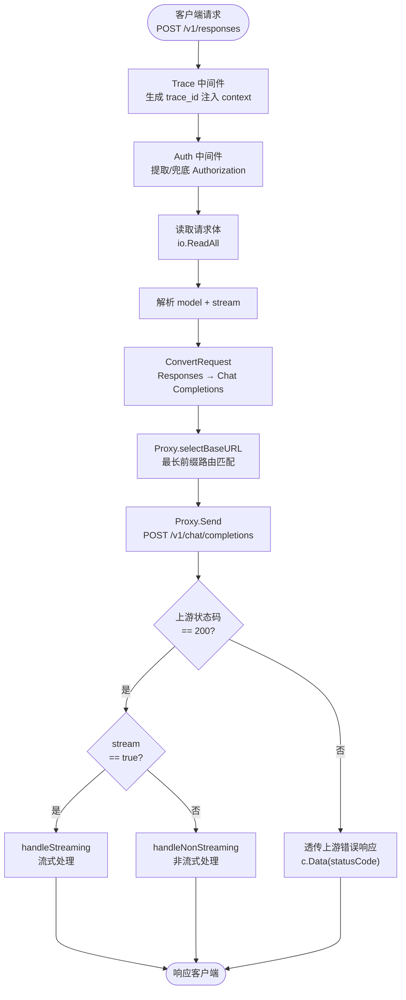
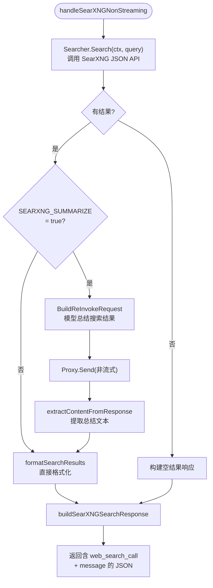
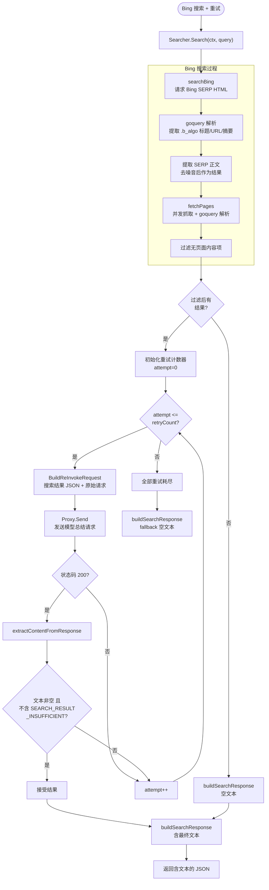
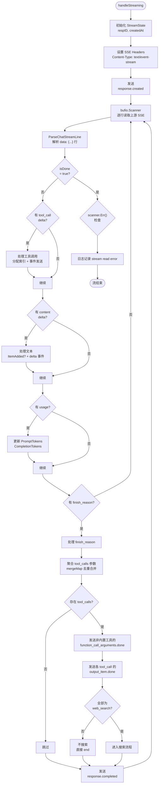
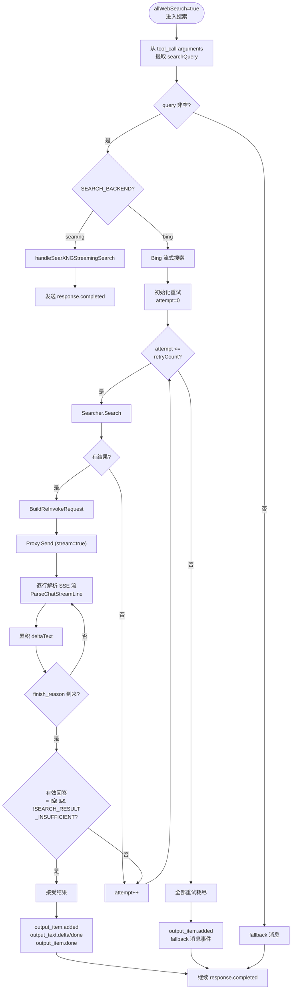
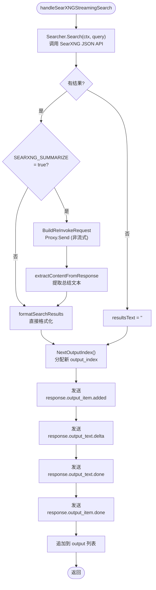
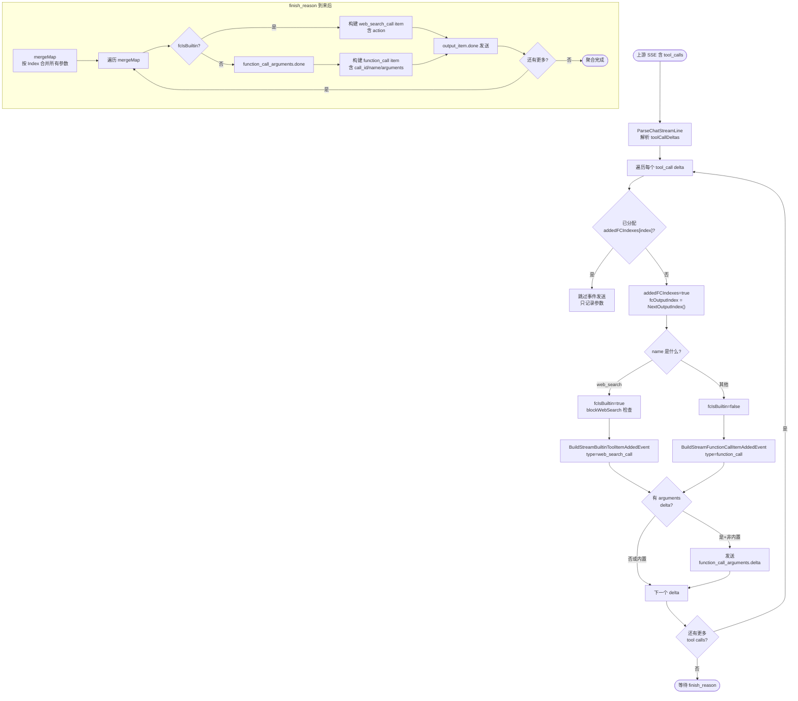
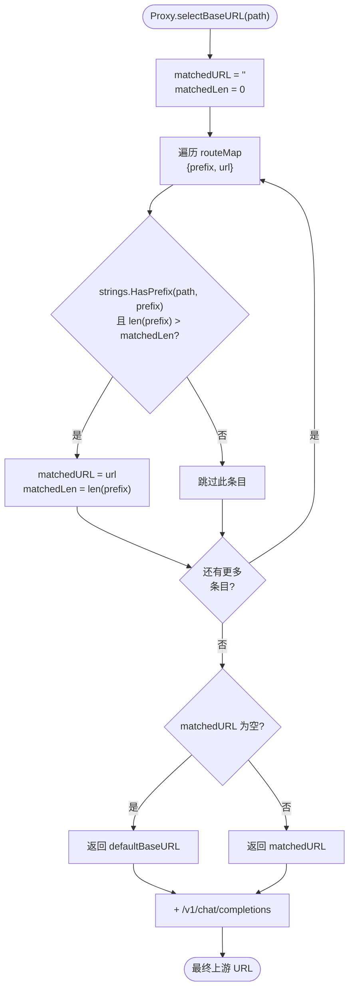
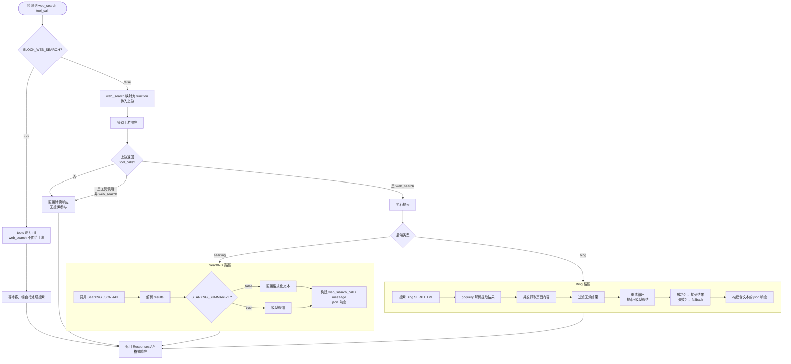
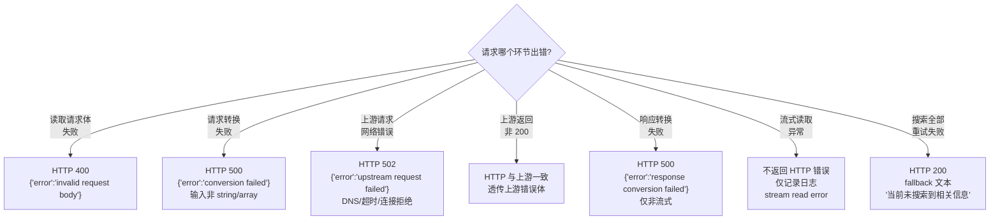

# opencode-openai-proxy 流程图

## 一、请求总流程图



---

## 二、非流式处理流程图

```mermaid
flowchart TB
    START(["handleNonStreaming<br/>非流式入口"]) --> READ_BODY["读取上游完整响应<br/>io.ReadAll"]
    READ_BODY --> DETECT["extractWebSearchToolCall<br/>检测 web_search tool_call"]
    DETECT --> HAS_SEARCH{"检测到<br/>web_search?"

    HAS_SEARCH -->|否| CONV_RESP["ConvertNonStreamingResponse<br/>直接转换"]
    CONV_RESP --> RETURN["c.Data 返回 JSON"]

    HAS_SEARCH -->|"是"| BLOCK_CHECK{"BLOCK_WEB_SEARCH<br/>= false?"}

    BLOCK_CHECK -->|false| CONV_RESP
    BLOCK_CHECK -->|true| BACKEND_CHECK{"SEARCH_BACKEND<br/>后端类型?"}

    BACKEND_CHECK -->|searxng| SEARXNG_NS[handleSearXNGNonStreaming]
    BACKEND_CHECK -->|bing| BING_NS[Bing 搜索 + 重试]

    SEARXNG_NS --> RETURN
    BING_NS --> RETURN
```

### 2.1 SearXNG 非流式子流程



### 2.2 Bing 非流式 + 重试子流程



---

## 三、流式处理流程图

### 3.1 流式主流程



### 3.2 流式搜索子流程（finish_reason 后触发）



### 3.3 SearXNG 流式搜索子流程



---

## 四、工具调用处理流程图



---

## 五、路由选择流程图



---

## 六、输入格式转换流程图

```mermaid
flowchart TB
    START(["convertInput(raw)"]) --> EMPTY_CHECK{"raw 为空?"}
    EMPTY_CHECK -->|是| EMPTY_RET["返回 nil"]

    EMPTY_CHECK -->|否| STRING_CHECK{"raw[0] == '\"'<br/>字符串?"}
    STRING_CHECK -->|是| STRING_CONV["解析为 string<br/>→ [{role:user, content:string}]"]
    STRING_CHECK -->|否| ARRAY_CHECK{"raw[0] == '['<br/>数组?"}

    ARRAY_CHECK -->|否| ERROR["返回 error<br/>input must be string or array"]

    ARRAY_CHECK -->|是| PARSE["json.Unmarshal → []inputItem"]
    PARSE --> LOOP["遍历 items"]

    LOOP --> TYPE_CHECK{"item.type?"}

    TYPE_CHECK -->|function_call_output| FCO["output 非空?"]
    FCO -->|是| USER_MSG["→ {role:user, content: '工具执行结果:\\n' + output}"]
    FCO -->|否| SKIP["跳过此 item"]

    TYPE_CHECK -->|web_search_call| WSC["output 非空?"]
    WSC -->|是| WEB_MSG["→ {role:user, content: 'Web search results:\\n' + output}"]
    WSC -->|否| SKIP

    TYPE_CHECK -->|message 或无 type| MESSAGE["按 role 处理"]
    MESSAGE --> ROLE_CHECK{"item.role?"}
    ROLE_CHECK -->|developer| TO_SYSTEM["→ role=system"]
    ROLE_CHECK -->|user| TO_USER["→ role=user"]
    ROLE_CHECK -->|assistant| TO_ASSISTANT["→ role=assistant"]
    ROLE_CHECK -->|其他| SKIP

    TO_SYSTEM --> CONTENT["extractContent(item.Content)"]
    TO_USER --> CONTENT
    TO_ASSISTANT --> CONTENT
    CONTENT --> APPEND["追加到 messages"]

    TYPE_CHECK -->|其他类型| SKIP

    SKIP --> MORE{"还有<br/>更多?"}
    USER_MSG --> MORE
    WEB_MSG --> MORE
    APPEND --> MORE

    MORE -->|是| LOOP
    MORE -->|否| RETURN(["返回 []Message"])
    STRING_CONV --> RETURN
    EMPTY_RET --> RETURN
    ERROR --> RETURN
```

---

## 七、搜索完整流程图（含所有分支）



---

## 八、错误处理流程图


